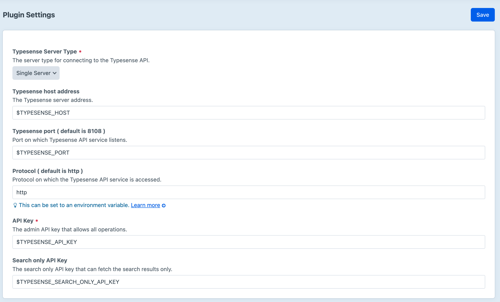

# Configuration

## Connect Typesense with Craft CMS
There are two ways of setting up a connection from Craft CMS to Typesense. You can setup a managed cloud service in [Typsense Cloud](https://cloud.typesense.org/) or use a local machine / self hosting approach. To read more about these setups, please go to the [Typsense Guide](https://typesense.org/docs/guide/).

## Settings
If you go to the plugin settings, you'll find the different Typesense Server Type settings. You can either connect to a single server, this can either be a self hosted server or a single cluster. If you want a cluster with multiple nodes, you can choose the cluster and add the different nodes ; seperated and the load balanced endpoint.

You can create a cluster on [Typesense Cloud](https://cloud.typesense.org) and generate the API keys.

The settings page supports environment variables, this makes it able to setup indexes for different environments.

## Setup a server in Docker
If you want to use a self hosted server and replicate the setup in Docker, you can follow the steps bellow to setup a Docker container.

### Dockerfile
```
FROM typesense/typesense:0.22.2
```

### docker-compose.yml
```
  typesense:
    build:
      context: ./docker-config/typesense
      dockerfile: ./Dockerfile
    environment:
      TYPESENSE_DATA_DIR: /data
      TYPESENSE_API_KEY: xxxxx
      TYPESENSE_SEARCH_ONLY_API_KEY: xxxx
      TYPESENSE_ENABLE_CORS: 1
    ports:
      - "3604:8108"
    volumes:
      - typesense-data:/data
```

### Settings

```
TYPESENSE_API_KEY=xxxxx
TYPESENSE_SEARCH_ONLY_API_KEY=xxxxx
TYPESENSE_HOST=typesense
TYPESENSE_PORT=8108
```